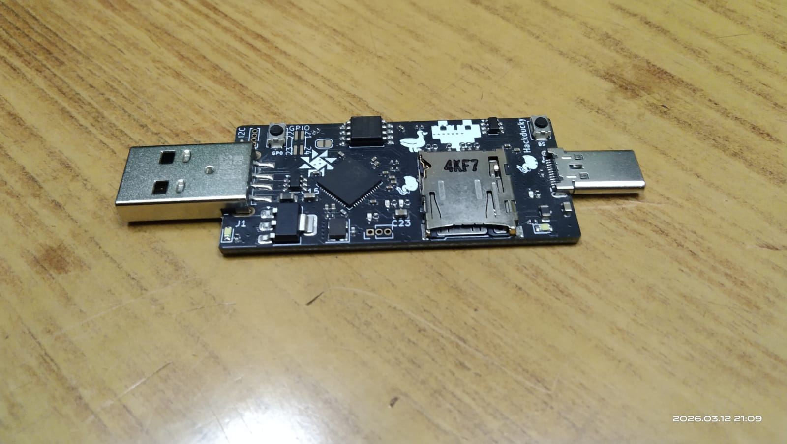
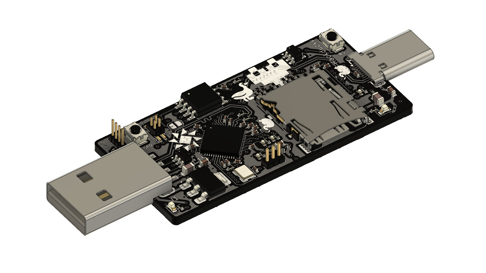

# HackDucky - A penetration testing tool.



## What is HackDucky
HackDucky is a compact USB automation and security testing device designed in a small portable form factor. It is inspired by keystroke-injection tools and can emulate a USB keyboard to execute scripted commands automatically when plugged into a computer.The device is powered by a rp2040 and supports payload scripting, making it useful for automation, demonstrations, and authorized penetration testing.
Below is the render of the HackDucky board.


## Why HackDucky
Most devices designed for USB automation or security testing are either expensive, closed-source, or difficult for beginners to modify. We wanted to build something compact, affordable, and easy to experiment with while still being powerful enough for real projects. HackDucky aims to provide a small, portable platform for USB automation, inspired by devices used in security research such as USB Rubber Ducky and other BadUSB-style tools.

Our board is powered by the reliable Raspberry Pi RP2040 microcontroller and includes 16 MB of flash storage, giving plenty of room for scripts and firmware. It also features an SD card slot, allowing users to store and switch between multiple payloads or automation scripts easily. This makes the device flexible for experimentation, demos, and authorized security testing.

HackDucky is designed for a wide range of users. Students can explore how USB HID devices work and learn about hardware security concepts. Makers can use it as a programmable USB automation tool for repetitive tasks. Security enthusiasts can experiment with BadUSB-style techniques in controlled environments, while developers can modify the firmware and hardware to create their own custom tools.

# Features

- RP2040 Microcontroller – Dual-core Arm Cortex-M0+ running at 133 MHz
- 16 MB Flash Storage – Store firmware and large script libraries
- USB-A + USB-C Ports – Flexible connection to different hosts
- MicroSD Card Slot – External storage for payloads and logs
- Led Indicator – Shows device status and script execution
- HID Emulation – Can behave as a keyboard or other USB device
- Script Execution – Run automation scripts automatically
- Open Hardware Design – Fully customizable firmware and PCB
- Compact Portable PCB – Designed for experimentation and hacking

## Getting Started

Your HackDucky ships **without firmware preinstalled**, so you need to flash it before using the board.

### Step 1 — Flash CircuitPython

1. Visit the CircuitPython download page for the RP2040.
2. Download the `.uf2` firmware file.
3. Plug your HackDucky into your computer.
4. A drive named **RPI-RP2** should appear.
5. Drag and drop the `.uf2` file onto the drive.

After flashing, a new drive named **CIRCUITPY** should appear.

---

### Step 2 — Install the Firmware

1. Clone the repository:

```bash
git clone https://github.com/hackclub/hackducky
```
2. Open the repository and navigate to the firmware directory.

3. Copy all files from the firmware folder to the CIRCUITPY drive.

4. Replace existing files if prompted.

5. Delete the existing code.py file.

### Step 3 — Add Your Script

1. Open the ducks folder on the HackDucky drive.

2. Delete any existing files in the folder.

3. Copy your script into the folder with the .ducky extension.

4. Your HackDucky is now ready to run scripts.

```bash
Enjoy ¯\_(ツ)_/¯
```

## Keystroke emulation (wait for video)

<video width="560" height="315" controls>
  <source src="gallery/keystroke.mp4" type="video/mp4">
  Your browser does not support the video tag.
</video>

# Team
- @Souptik Samanta
- @Aarav Jham
- @Some1

# Contact
Email Souptik at me@souptik.me(me[at]souptik[dot]me)
